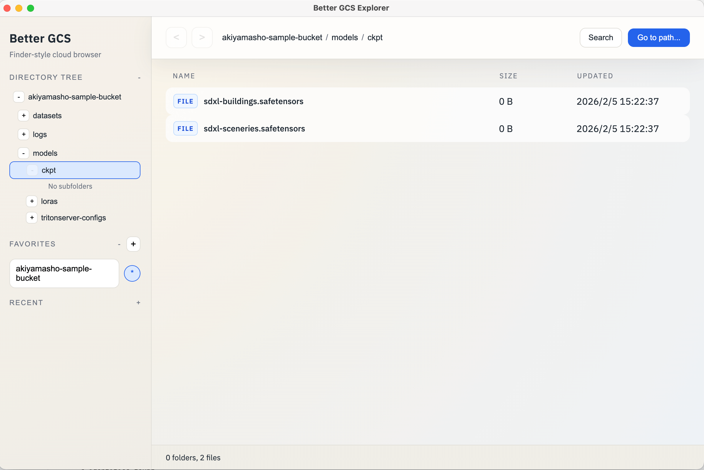

# Better GCP


Local-only Electron app for browsing Google Cloud Platform services with a Finder-like UI.



## Services

### Cloud Storage
- Finder-like browsing with breadcrumbs and directory tree.
- Favorites and recents for fast bucket access.
- Quick Open (Cmd/Ctrl+Shift+O) for already-loaded items.
- Go to path (Cmd/Ctrl+Shift+P) modal for direct navigation.
- Context menu actions: copy paths and gsutil commands.
- Drag-and-drop upload and drag-out download.
- Batch selection bar with download/delete actions and select-all toggle.
- Per-row download button and file-only delete actions.
- Create-folder action in empty-space context menu.

### BigQuery
- Sidebar tree for projects, datasets, and tables.
- Quick Jump (Cmd/Ctrl+Shift+P) with regex search across loaded tables.
- Table preview (LIMIT 5) on click.
- Query editor with Cmd/Ctrl+Enter to run.
- Tab-based query management for switching between queries.
- Save and load queries.
- Favorites for frequently accessed tables.

## Prereqs
- Node.js (18+)
- `gcloud` (`brew install gcloud-cli`)
- `pnpm` (`brew install pnpm`)
- Application Default Credentials: `gcloud auth application-default login`

## Package and run (macOS)
```bash
make run
```

NOTE: `make dev` for hot-reloading dev runs has an issue and is currently commented-out.

## Build DMG (macOS)
```bash
make dmg
```

## Notes
- Quick Open only searches already-loaded folders and files.
- Drag a file from the list to the desktop to download via a temp file.
- Drop local files or folders into the list to upload to the current prefix.

## Changelog
See [`CHANGELOG.md`](./CHANGELOG.md)
